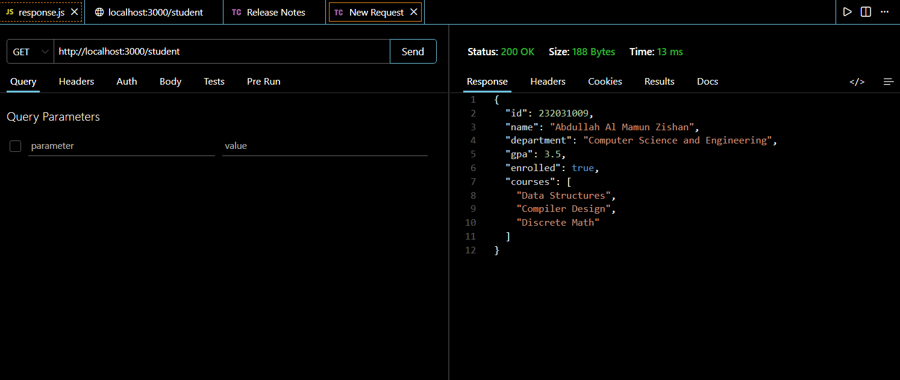

# ITPM Task 1 - Express Student API


This project is a simple Node.js and Express.js backend implementation that serves student information in a formatted JSON structure. This was developed as part of the ITPM course tasks.

## 🚀 Features
*   **Express.js Routing**: Custom `/student` route.
*   **JSON Response**: Returns structured student data including ID, Name, Major, and GPA.
*   **API Testing**: Fully verified using Postman.

## 🛠️ Tech Stack
*   **Backend**: Node.js, Express.js
*   **Tools**: VS Code, Postman
*   **Version Control**: Git/GitHub

## 📸 API Verification (Postman)
Below is the screenshot of the successful API request made to `http://localhost:3000/student`:

 

## 🏃‍♂️ How to Run Locally

1. **Clone the repository:**
   ```bash
   git clone [https://github.com/Zishan-125/itpm_task1.git](https://github.com/Zishan-125/itpm_task1.git)
   cd itpm_task1
   ```
Install dependencies:

```bash
npm install
```
Start the server:

```bash
node response.js
```

4. **Access the API:**
   Open your browser or Postman and navigate to: `http://localhost:3000/student`

## 👤 Author
**Abdullah Al Mamun Zishan**
**ID:232031009*
